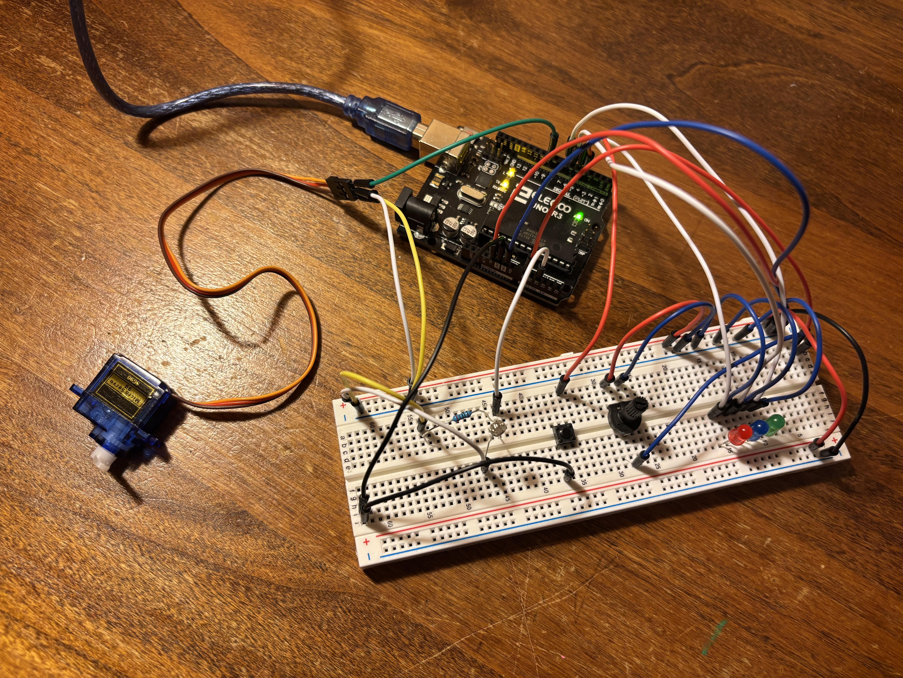

# serial-bridge-project

# Serial Bridge Dashboard

A live console dashboard for Windows that talks to an Arduino over serial: it streams sensor telemetry (potentiometer, button, photoresistor) into a real-time display, logs every reading to CSV, and lets you send commands back to control LEDs and a servo.

## Features

- Live-updating console dashboard (no flicker, no scrollback spam — redraws in place using an alternate screen buffer)
- Reads potentiometer, button, and light-level readings from the Arduino over serial
- Logs every sensor reading to a timestamped CSV file
- Send commands from the dashboard to control 3 LEDs and a servo
- Runs the serial reader on a background thread so the UI stays responsive

## Hardware Required

- Arduino Uno (or compatible AVR board)
- 1x potentiometer
- 1x photoresistor (light sensor)
- 1x push button
- 3x LEDs (red, green, blue) + current-limiting resistors
- 1x servo motor
- Breadboard + jumper wires
- USB cable (Arduino to PC)

## Wiring

| Component           | Arduino Pin      |
|---------------------|------------------|
| Potentiometer       | A0               |
| Photoresistor       | A2               |
| Push button         | 4 (INPUT_PULLUP) |
| Red LED             | 5                |
| Blue LED            | 6                |
| Green LED           | 7                |
| Servo signal        | 9                |

### Circuit Photo



## Software Requirements

- **Arduino IDE** (or the VS Code Arduino extension) with the `Servo` library installed, for flashing the firmware
- **MSYS2 / MinGW-w64 (g++)** for building the host dashboard on Windows
- Windows (the dashboard uses the Win32 serial API directly)

## Setup

### 1. Flash the Arduino firmware

Open `serial-bridge-project.ino` in the Arduino IDE, select your board and port, and upload.

### 2. Build the host dashboard

```
g++ -fdiagnostics-color=always -g host_serial_test.cpp -o host_serial_test.exe
```

### 3. Run it

Make sure the Arduino is plugged in and not already open in another program (e.g. the Arduino Serial Monitor — only one program can hold the COM port at a time), then run:

```
host_serial_test.exe
```

> The dashboard is currently hardcoded to `COM3`. If your board enumerates on a different port, check Device Manager and update the `openSerialPort(...)` call (or the `CreateFileA(...)` call if you're on the single-file version) accordingly.

## Usage

Once running, the dashboard shows live sensor readings and accepts commands typed directly into the terminal:

| Command      | Effect                           |
|--------------|----------------------------------|
| `R1` / `R0`  | Red LED on / off                 |
| `G1` / `G0`  | Green LED on / off               |
| `B1` / `B0`  | Blue LED on / off                |
| `S000`–`S180`| Set servo angle (0–180 degrees)  |
| `q`          | Quit                             |

## Data Logging

Every sensor reading is appended to a CSV file named `sensor_log_<timestamp>.csv`, created fresh each time the dashboard starts, with columns:

```
Timestamp,Potentiometer,Button,Light
```

## Project Structure

```
serial-bridge-project.ino   # Arduino firmware
host_serial_test.cpp        # Host dashboard (Windows console app)
```